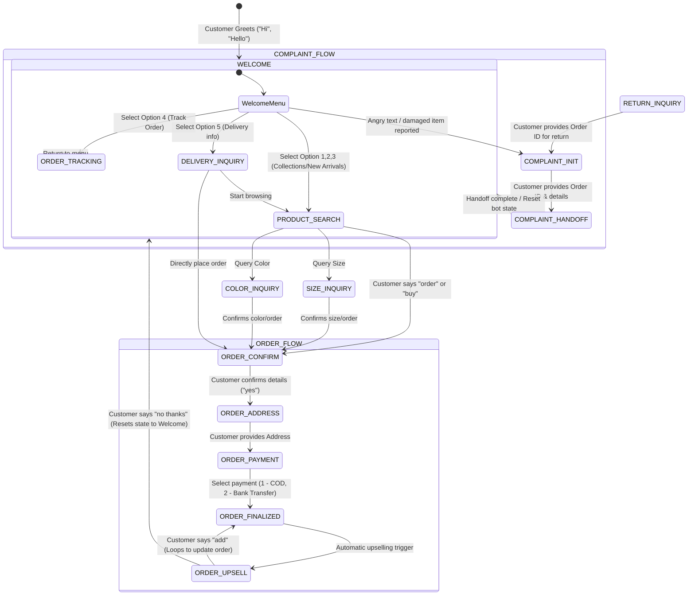

# 🧠 AI Prompts & Flows Module

This module serves as the **conversational brain** of the AI Fashion Sales Assistant. It defines the brand personality, system prompts, conversational state machines, predefined templates, and language detection rules required to engage clothing brand customers naturally in **English, Urdu (Script), and Roman Urdu (Latin script Urdu)**.

---

## 📁 Module Structure

All assets are located in `backend/src/ai/prompts/`:
* **`index.js`**: Unified entry point for importing prompts, flows, replies, and rules.
* **`system_prompts.js`**: Master and intent-specific system prompts defining the AI's persona and constraints.
* **`conversation_flows.js`**: State machine definitions, user transition actions, and bilingual chat layouts.
* **`predefined_replies.js`**: Templated replies for high-frequency queries (e.g. shipping fees, exchange policy, etc.).
* **`language_rules.js`**: Logic to detect language (English, Urdu Script, Roman Urdu) and handle code-switching.
* **`test_prompts.js`**: Verification test suite to validate the module.

---

## 🛠️ How to Integrate (AI Core & Backend Handoff)

### 1. Import the Module
In your LangChain agent or Express route controllers, import the components:

```javascript
const {
  detectLanguage,
  isCodeSwitched,
  MASTER_SYSTEM_PROMPTS,
  INTENT_SYSTEM_PROMPTS,
  getPredefinedReply,
  CONVERSATION_STATES
} = require('./src/ai/prompts');
```

### 2. Detect Customer Language & Apply Style Guidelines
Before generating a response, pass the incoming customer message through `detectLanguage` to decide whether to respond in English (`en`), Urdu (`ur`), or Roman Urdu (`roman_urdu`):

```javascript
const userMsg = "Medium size available hai?";
const lang = detectLanguage(userMsg); // returns 'roman_urdu'

// Get the corresponding system prompt
const systemPrompt = MASTER_SYSTEM_PROMPTS[lang];
```

### 3. Handle Predefined Replies with Live Data
For low-ambiguity queries (like checking price or delivery charges), retrieve and compile replies using `getPredefinedReply`:

```javascript
// Example: Price Check Query
const reply = getPredefinedReply('price_check', lang, {
  product_name: "Floral Summer Dress",
  price: "3,499"
});
// If lang = 'roman_urdu': "Floral Summer Dress ki price Rs. 3,499 hai. Kya aap iska size check karna chahenge? 🛍️"
```

### 4. Drive the Conversation Flow State Machine
The n8n automation and backend chat controller can track the customer's conversational state (e.g. stored in MongoDB or session memory) to navigate sub-flows:

```javascript
// Mock State Controller
let currentState = customer.chatState || 'WELCOME';
const detectedIntent = 'ProductSearch'; // Classifed by AI Core Developer

// Get state definition
const stateDetails = CONVERSATION_STATES[currentState];

// Formulate transition key
const transitionKey = `intent:${detectedIntent}`;
const nextState = stateDetails.transitions[transitionKey] || stateDetails.transitions['default'];

// Update customer state
customer.chatState = nextState;
await customer.save();
```

---

## 🗺️ Conversation Flow State Diagram

The conversation flow is modeled as a state-machine. Here is the visual breakdown of the customer journey:



---

## 📋 Conversation States Reference

| State Name | Purpose | Expected User Input | Next Possible States |
| :--- | :--- | :--- | :--- |
| **`WELCOME`** | Greets customer, introduces FashionHub, displays main menu. | Greetings (`Hi`, `Assalam-o-Alaikum`), menu selections (`1` - `5`). | `PRODUCT_SEARCH`, `ORDER_TRACKING`, `DELIVERY_INQUIRY`, `COMPLAINT_INIT` |
| **`PRODUCT_SEARCH`** | Returns matching products with descriptions and prices from database. | Product types, categories, colors, budget. | `SIZE_INQUIRY`, `COLOR_INQUIRY`, `ORDER_CONFIRM`, `WELCOME` |
| **`SIZE_INQUIRY`** | Shares available sizes, size charts, or guidelines. | Size queries (`Medium size chart?`). | `ORDER_CONFIRM`, `PRODUCT_SEARCH` |
| **`COLOR_INQUIRY`** | Lists available color options or alternatives. | Color queries (`Is red available?`). | `SIZE_INQUIRY`, `ORDER_CONFIRM`, `PRODUCT_SEARCH` |
| **`DELIVERY_INQUIRY`** | Details shipping rates (standard/free tier) and timelines. | Delivery queries (`delivery charges to Pindi?`). | `PRODUCT_SEARCH`, `ORDER_CONFIRM`, `WELCOME` |
| **`RETURN_INQUIRY`** | Provides return and exchange policy information. | Return/Exchange queries (`exchange ho sakta hai?`). | `COMPLAINT_INIT` |
| **`ORDER_TRACKING`** | Requests tracking information / Order ID to lookup status. | Order ID or query (`mera order kahan hai?`). | `WELCOME` |
| **`ORDER_CONFIRM`** | Prompts user to confirm the product selection details. | Yes/No, or correction commands (`change size`). | `ORDER_ADDRESS`, `PRODUCT_SEARCH` |
| **`ORDER_ADDRESS`** | Collects shipping address and town/city. | Full home or shipping address. | `ORDER_PAYMENT` |
| **`ORDER_PAYMENT`** | Offers payment options: Cash on Delivery or Online. | Selection (`1` or `2`). | `ORDER_FINALIZED` |
| **`ORDER_FINALIZED`** | Displays order confirmation number and summary details. | (Automated transition) | `ORDER_UPSELL` |
| **`ORDER_UPSELL`** | Suggests a related trending product or matching accessory. | Add/Reject (`add` or `no thanks`). | `ORDER_FINALIZED`, `WELCOME` |
| **`COMPLAINT_INIT`** | Empathetic acknowledgment of issue, requests Order ID & description. | Explanation of problem, Order ID. | `COMPLAINT_HANDOFF` |
| **`COMPLAINT_HANDOFF`** | Informs customer that the conversation is flagged for human support. | (Automated transition) | `WELCOME` |

---

## 🧪 Running Validation Tests
To verify the rules and state transitions are working:
```bash
node backend/src/ai/prompts/test_prompts.js
```
All tests must report **`✅ PASS`** before pushing code changes.
